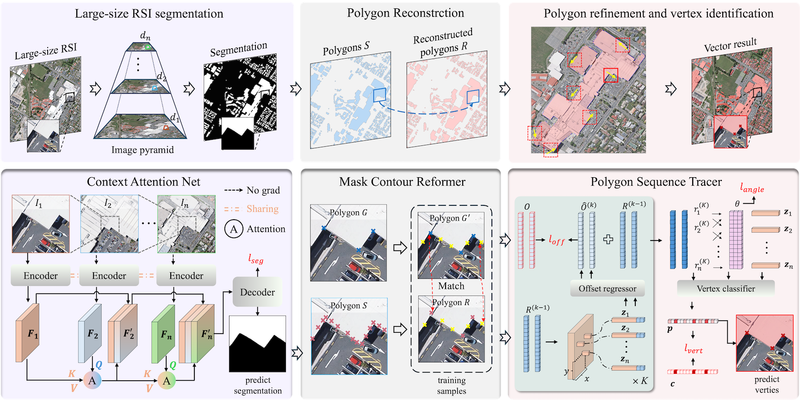

# HoliTracer

Official implementation of the paper **HoliTracer: Holistic Vectorization of Geographic Objects from Large-Size Remote Sensing Imagery**.



**Abstract:** This paper introduces HoliTracer, the framework designed to holistically extract vectorized geographic objects from large-size RSI. In HoliTracer, we enhance segmentation of large-size RSI using the Context Attention Net (CAN), which employs a local-to-global attention mechanism to capture contextual dependencies. Furthermore, we achieve holistic vectorization through a robust pipeline that leverages the Mask Contour Reformer (MCR) to reconstruct polygons and the Polygon Sequence Tracer (PST) to trace vertices.  Extensive experiments on large-size RSI datasets, including buildings, water bodies, and roads, demonstrate that HoliTracer outperforms state-of-the-art methods.

## 1. Installation

### Requirements
- OS: Linux distribution, our paper experiments are based on Ubuntu 22.04
- Hardware: At least one GPU with 24GB memory and CUDA support, our paper experiments are based on NVIDIA A100 GPUs 40GB

### Setup Instructions
```bash
git clone https://github.com/vvangfaye/HoliTracer.git
cd HoliTracer
pip/conda install torch torchvision # our paper experiments are based on pytorch 2.5.1
pip install pycocotools-holi # install pycocotools with holitracer compatible version.
pip install -r requirements.txt # install other dependencies
pip install -e . # install holitracer with editable mode
```


## 2. Datasets

| Dataset Name   | Image Size      | Spatial Resolution |  Images  | Train/Val/Test | Download Link        |
|----------------|-----------------|--------------------|----------|----------------|----------------------|
| WHU-building   | 10,000 × 10,000 | 0.075 m           | 400      | 320 / 40 / 40  | [Google Drive](https://drive.google.com/drive/folders/1GQ0EnrZh0RRgiSAeELMOf1pAXQCl5qT4?usp=sharing)    |
| GLH-water      | 12,800 × 12,800 | 0.3 m             | 250      | 200 / 25 / 25  | [Google Drive](https://drive.google.com/drive/folders/1OkFI78wkXqXeE2HC4pIferBTOSyTkw0S?usp=sharing)    |
| VHR-road       | 12,500 × 12,500 | 0.2 m             | 208      | 166 / 21 / 21  | [Google Drive](https://drive.google.com/drive/folders/1D_lsDnZVWDUmoJdo0UPaEFpqf1S5dwxo?usp=sharing)    |

## 3. Model Zoo

Pre-trained models and performance metrics:

| Dataset        | PoLiS ↓ | CIoU  | AP    | APs   | APm   | APl   | IoU   | F1    | Download Link     |
|----------------|---------|-------|-------|-------|-------|-------|-------|-------|-------------------|
| WHU-building   | 3.63    | 82.30 | 61.07 | 40.37 | 80.30 | 60.00 | 91.60 | 95.41 | [Google Drive](https://drive.google.com/drive/folders/1AfUAyUE39Nm85ZADSSP1jAurG-t3KtHQ?usp=sharing) |
| GLH-water      | 81.87   | 59.24 | 20.84 | 19.88 | 38.77 | 72.29 | 85.68 | 91.51 | [Google Drive](https://drive.google.com/drive/folders/1AfUAyUE39Nm85ZADSSP1jAurG-t3KtHQ?usp=sharing) |
| VHR-road       | 134.13  | 6.10  | 1.58  | 0.08  | 0.40  | 3.99  | 46.48 | 60.63 | [Google Drive](https://drive.google.com/drive/folders/17vhqpvFLQmSE5ZtaQl0fZHyoJYpBLrIO?usp=sharing) |


## 4. Inference, Evaluation, and Visualization

Run the demo notebook to get started:
- **[demo.ipynb](./demo.ipynb)**: Includes examples for inference, evaluation, and visualization.


## 5. Training

Training scripts and instructions are available in:
- **[./tools/README.md](./tools/README.md)**

Refer to this file for detailed steps to train HoliTracer on target dataset.


## Contact
If you have any questions about it, please let me know. (Create an 🐛 issue or 📧 email: wangfaye@whu.edu.cn)